# Mythos of Loki: DetailsView Grid Architecture

## 1. Visual Layout Wireframe

```
┌────────────────────────────────────────────────────────────────────────────────────────────────────────┐
│                                       HEADER BANNER (Row 0)                                            │
│   [Full-Width Background Banner Image - MinHeight: 150px / Ambient Glow Layer]                         │
│                                                                                                        │
│                                   ┌───────────────────────────┐                                        │
│                                   │     GAME LOGO / TITLE     │                                        │
│                                   │   (ExtraMetadataLoader)   │                                        │
│                                   └───────────────────────────┘                                        │
│                                                                                                        │
├────────────────────────────────────────────────────────────────────────────────────────────────────────┤
│                           STICKY ACTION & STATUS BAR (Height: 68px, Sticky at Top)                     │
│ ┌─────────────────────────┐  ┌──────────────────────────────────────────────────┐  ┌─────────────────┐ │
│ │ [▶ Play] [⬇] [...]      │  │ 🕒 LAST PLAYED  ⏱ TIME PLAYED  💾 SIZE  📁 PATH  │  │ [✏] [ℹ] [★] [⚡] │ │
│ │ (Accent Blue Gradient)  │  │ (Relative Time) (Formatted)  (84 GB) (Open Dir)   │  │ (Quick Tools)   │ │
│ │ (Electric Blue 40px)    │  │ 📦 COMPLETION STATUS: [Completed / Settable]     │  │ (Quick Tools)   │ │
│ └─────────────────────────┘  └──────────────────────────────────────────────────┘  └─────────────────┘ │
├────────────────────────────────────────────────────────────────────────────────────────────────────────┤
│                                    MAIN CONTENT GRID (Row 1)                                           │
│                                                                                                        │
│  LEFT COLUMN (70% Width: 7*)                              RIGHT COLUMN (30% Width: 3*)                 │
│ ┌──────────────────────────────────────────────────────┐ ┌───────────────────────────────────────────┐ │
│ │ 🎬 MEDIA / VIDEO PLAYER (Fixed MaxHeight: 340px)     │ │ 🖼 GAME COVER BOX ART                       │ │
│ │ • Visible ONLY when ExtraMetadataLoader Video is ON  │ │   (PART_ImageCover + Age Rating Badge)      │ │
│ │ • Completely Collapses when Video is Disabled/Off    │ │                                             │ │
│ │ • Fallback Image / Screenshot Preview                │ │ 🏆 SCORES & RATINGS                         │ │
│ ├──────────────────────────────────────────────────────┤ │ • Metacritic Score Pill (88)                │ │
│ │ 🔗 STEAM / STORE LINKS BAR                           │ │ • Community 5-Star Rating                   │ │
│ │ [Store Page] [Community Hub] [Discussions]           │ ├───────────────────────────────────────────┤ │
│ ├──────────────────────────────────────────────────────┤ │ 📋 METADATA SIDEBAR TABLE                   │ │
│ │ 📝 GAME SYNOPSIS / DESCRIPTION                       │ │ • Series: PART_ElemSeries                   │ │
│ │ (Formatted Rich HTML Description & Synopsis)         │ │ • Developer: PART_ElemDevelopers            │ │
│ ├──────────────────────────────────────────────────────┤ │ • Publisher: PART_ElemPublishers            │ │
│ │ 🏷 GENRES & FEATURES CHIPS                           │ │ • Release Date: PART_ElemReleaseDate        │ │
│ │ [Action] [RPG] [Open World] [Single-Player]          │ │ • Platform Badge: PART_ElemPlatform         │ │
│ ├──────────────────────────────────────────────────────┤ │ • Tags: PART_ElemTags (Clickable Chips)     │ │
│ │ 📸 SCREENSHOTS GALLERY / CAROUSEL                    │ ├───────────────────────────────────────────┤ │
│ │ (ScreenshotsVisualizer Integration)                  │ │ 🧩 PLUGIN FEEDS                             │ │
│ │                                                      │ │ • HowLongToBeat Stats                       │ │
│ │                                                      │ │ • SuccessStory Achievements Grid            │ │
│ │                                                      │ │ • GameActivity Playtime Analytics           │ │
│ └──────────────────────────────────────────────────────┘ └───────────────────────────────────────────┘ │
└────────────────────────────────────────────────────────────────────────────────────────────────────────┘
```

---

## 2. Component & WPF Template Hierarchy

```mermaid
graph TD
    Root[DetailsViewGameOverview.xaml] --> Row0[Row 0: Top Header Banner]
    Root --> RowActionBar[Action & Status Bar - MinHeight 68px]
    Root --> Row1[Row 1: Main Content Section 2-Column Grid]

    subgraph Header Banner
        Row0 --> BgImg[PART_ImageBackground / UniformToFill]
        Row0 --> Logo[ExtraMetadataLoader_LogoLoaderControl]
        Row0 --> FallbackTitle[PART_TextDisplayName with DropShadow]
    end

    subgraph Action Bar
        RowActionBar --> LeftActions[Left Actions]
        LeftActions --> BtnPlay[PART_ButtonPlayAction - Primary Accent Gradient]
        LeftActions --> BtnContext[PART_ButtonContextAction - Install/Uninstall]
        LeftActions --> BtnMore[PART_ButtonMoreActions - Menu]

        RowActionBar --> CenterMeta[Center Metadata]
        CenterMeta --> MetaLastPlayed[PART_ElemLastPlayed: Icon + LOCMythos_RecentActivity]
        CenterMeta --> MetaPlayTime[PART_ElemPlayTime: Icon + LOCMythos_PlayTime]
        CenterMeta --> MetaInstallSize[PART_ElemInstallSize: Icon + LOCInstallSizeLabel]
        CenterMeta --> MetaInstallDir[PART_ElemInstallDirectory: Icon + LOCGameInstallDirTitle]
        CenterMeta --> MetaCompStatus[PART_ElemCompletionStatus: Settable Dropdown]

        RowActionBar --> RightTools[Right Quick Tools]
        RightTools --> ToolEdit[PART_ButtonEditGame]
        RightTools --> ToolPanel[PanelToggleButton]
        RightTools --> ToolFav[GameFavoriteToggleButton]
        RightTools --> ToolPlayState[PlayState_GameStateSwitchControl]
    end

    subgraph Main Content Grid
        Row1 --> ColLeft[Left Column: 1.6*]
        Row1 --> ColRight[Right Column: 1.0*]

        ColLeft --> VideoBox[Media / Video Preview - MaxHeight: 340px]
        VideoBox --> VideoFeed[ExtraMetadataLoader_VideoLoaderControl]
        VideoBox --> FallbackImg[PART_ImageContainer / Screenshots]
        ColLeft --> SteamLinks[SteamLinksBorder]
        ColLeft --> Desc[PART_ElemDescription / Notes]
        ColLeft --> Genres[PART_ItemsGenres & PART_ItemsFeatures]
        ColLeft --> ScreenVis[ScreenshotsVisualizer Gallery]

        ColRight --> Cover[PART_ImageCover & Age Rating]
        ColRight --> Scores[Metacritic & 5-Star Community Ratings]
        ColRight --> MetaTable[Metadata Table: Series, Devs, Pubs, Release, Platform, Tags]
        ColRight --> Plugins[HLTB, SuccessStory Achievements, GameActivity Charts]
    end
```



---

## 3. Key Layout Specifications

| Section | Sizing & Styling | WPF Binding / Plugin Hook |
| :--- | :--- | :--- |
| **Top Banner** | `MinHeight="150"`, Ambient Glow, Z-Index 95 | `PART_ImageBackground`, `ExtraMetadataLoader_LogoLoaderControl` |
| **Play Button** | `Height="40"`, `MinWidth="110"`, Accent Gradient | `PART_ButtonPlayAction` (`LOCPlayGame`, `&#xE768;`) |
| **Action Bar** | `MinHeight="68"`, `Padding="40,14"`, Glass Backdrop | `HeaderRow`, `BackdropGlass1` |
| **Last Played** | `FontSize="14"`, SemiBold text, Clock icon | `PART_ElemLastPlayed` (`PART_TextLastActivity`) |
| **Play Time** | `FontSize="14"`, SemiBold text, Timer icon | `PART_ElemPlayTime` (`PART_TextPlayTime`) |
| **Install Size** | `FontSize="14"`, SemiBold text, Drive icon | `PART_ElemInstallSize` (`PART_TextInstallSize`) |
| **Install Folder**| `FontSize="14"`, Clickable path, Folder icon | `PART_ElemInstallDirectory` (`PART_ButtonInstallDirectory`) |
| **Completion** | Custom styled dropdown or pill badge | `PART_ElemCompletionStatus` (`ThemeExtras_SettableCompletionStatus`) |
| **Video Player**| `MaxHeight="340"`, `MaxWidth="580"`, 16:9 ratio | `ExtraMetadataLoader_VideoLoaderControl` (Strict visibility triggers) |
| **Cover & Info**| Fixed width right column, 24px spacing | `PART_ImageCover`, `PART_ElemPlatform`, `PART_ElemTags` |
